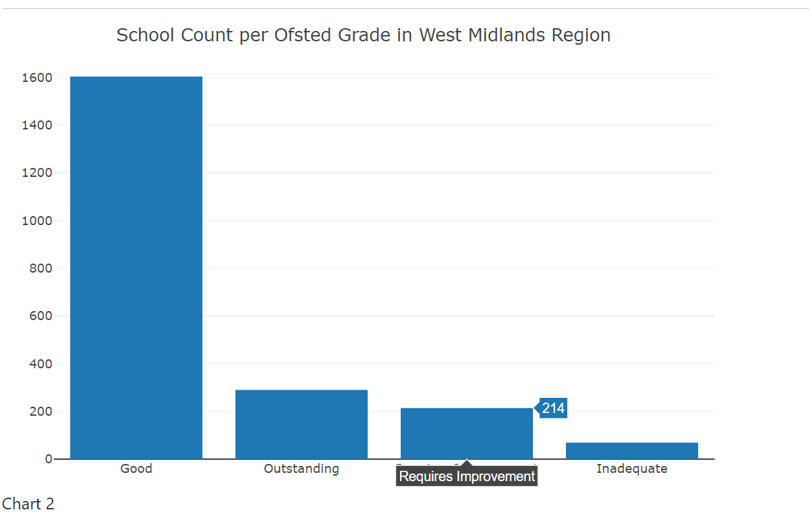

# Topic: Ofsted rating per school in West Midlands

Team Members:
Ryan Barker, Farheen Oomatia, Arfan Hassan, Suwaiba Idris , Esala Kaluperuma

### Source: https://www.gov.uk/government/statistics/state-funded-schools-inspections-and-outcomes-as-at-31-august-2023

### Requirements/Grading Rubrik

[Rubrik]("C:\Users\tutuw\Desktop\Boot_camp\Projects\Project_3\images\Project3_Rubric.pdf")

We were required to work within a group to tell a story using data visualizations. The visualization must include a Python Flask-powered API, HTML/CSS, JavaScript, and at least one database (SQL, MongoDB, SQLite, etc.). The project should fall into one of the following three tracks:
A combination of web scraping and Leaflet or Plotly
A dashboard page with multiple charts that update from the same data
A server that performs multiple manipulations on data in a database prior to visualization (must be approved)
The project should include at least one JS library that was not covered in class.
The project must be powered by a dataset with at least 100 records.
The project must include some level of user-driven interaction (e.g., menus, dropdowns, textboxes).
The final visualization should ideally include at least three views.

## Introduction 
For this project we chose to analyse Ofsted rating schools in the West Midlands. Ofsted is the office responsible for inspecting the standards and services provided by Educational intitutions. Schools are evaluated based on a four-point scale, ranging from grade 1 (outstanding) to grade 4 (inadequate). This grading system is also applied to determine the overall effectiveness of schools. The primary objective of this project is to analyze data and extract meaningful insights for visualization on a dashboard. The ultimate aim is to deepen our comprehension of top-performing schools in the West Midlands, enabling informed decision-making in the selection of schools within the County of West Midlands, United Kingdom. Our analysis is specifically focused on primary and Secondary Schools.

## Data Cleaning 

We obtained a substantial dataset from gov.uk, consisting of more than 22,000 rows. To streamline our analysis, we opted to leverage Jupyter Notebook for data cleaning and filtering, focusing on selecting specific columns and rows. Through this process, we successfully narrowed down the dataset to slightly over 2,000 rows, retaining only the essential data for our analysis. Additionally, we pruned unnecessary columns and modified their names to eliminate spaces and special characters. Ratings were changed from intergers to string for better understanding and null values removed. As a final step, we created another table with urn, school name and postcode to this we appended latitude and longitude, using the Geoapify.com we then merged these two tables and obtained our "Cleaned_Dataset".

## SQLite Creation
The Cleaned_Dataset was initially loaded into a CSV file and subsequently transformed into an SQLite database named "ofsted_results". Within this database, a table named "ofsted_data" was established, with all the requisite columns for further analysis.

## Flask App 
 Through Visual Studio Code, we established a connection to the "ofsted_results" database and created a Flask API. This API was built utilizing JSON files generated from the aforementioned database.

## Dashboard 
## Results & Conclusion 
Our analysis showed there are 2192 Primary and Secondary schools in the West Midlands. Most of the schools in the West Midlands have a rating of "Good" (1603 schools)

This project is Built with
Python
Flask
SQLite
HTML
CSS
JavaScript
D3
Getting Started:
ETL.ipynb
